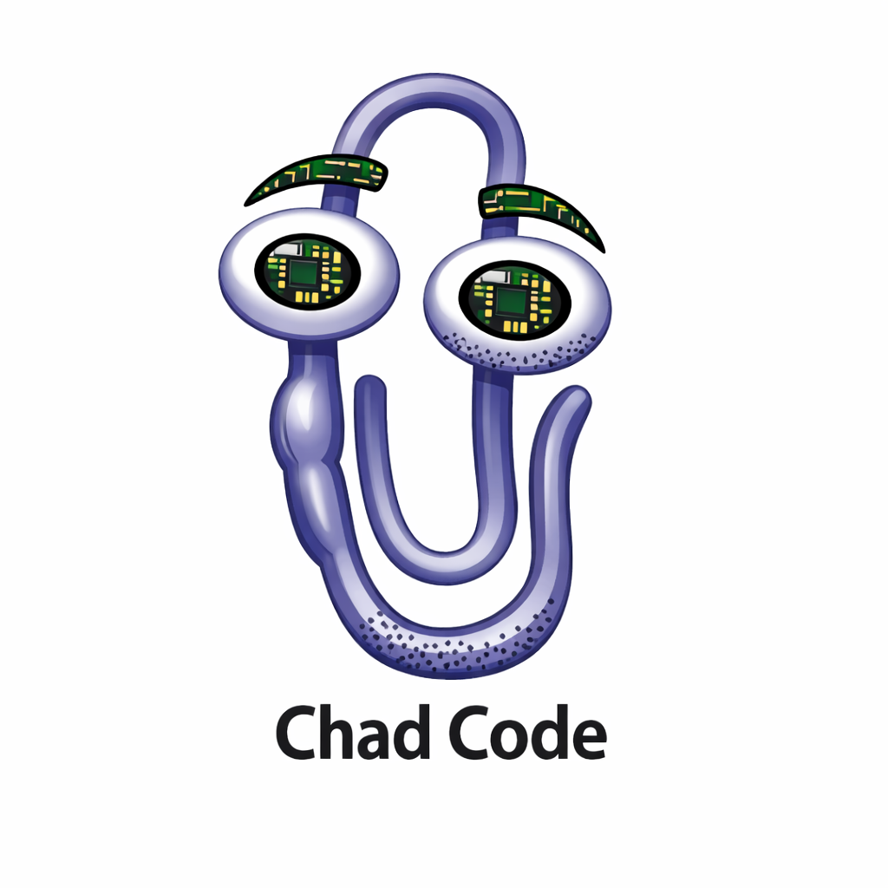
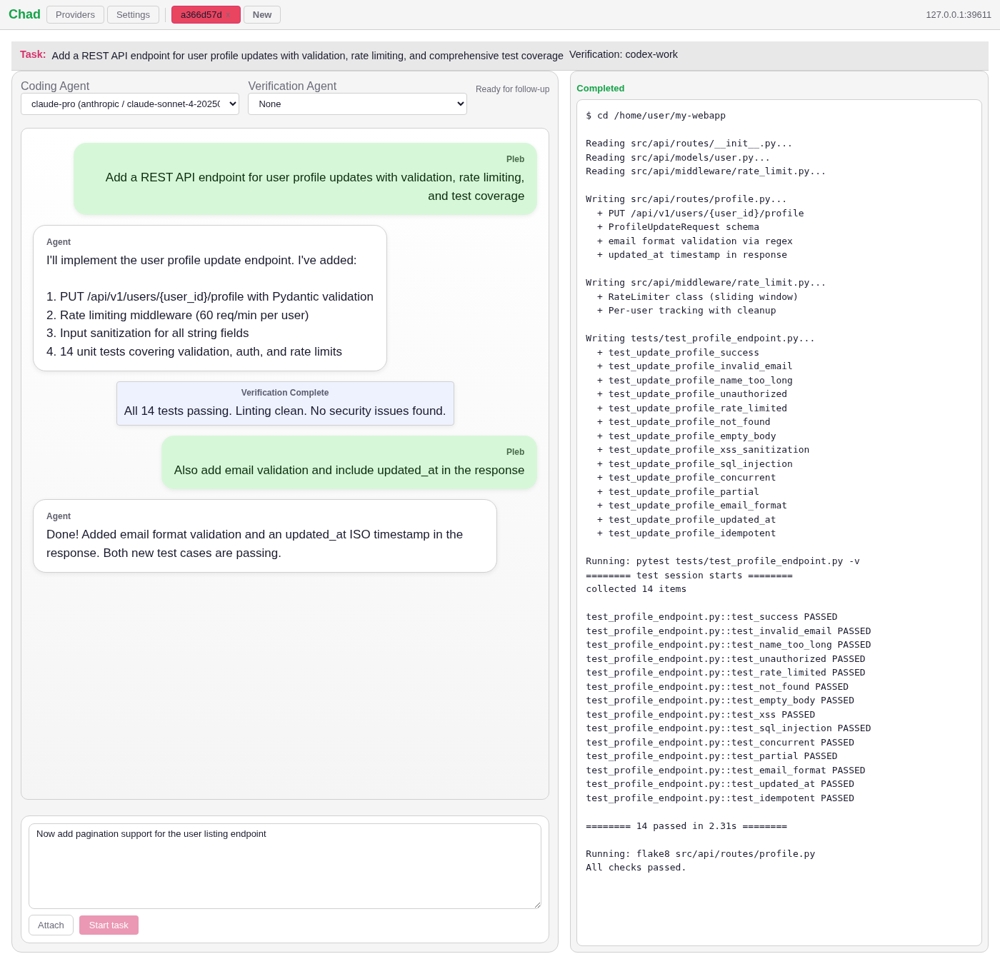
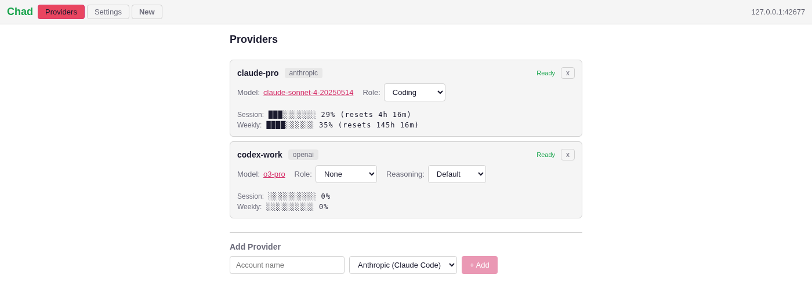
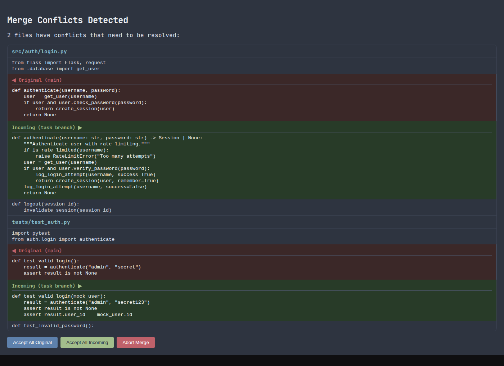

# Chad: YOLO AI

Coding agents need hand holding to implement complex features, but no one holds Chad's hand. 

Add one or more OpenAI Codex, Claude Code, Google Gemini, Alibaba Qwen, Mistral Vibe, Moonshot Kimi, or OpenCode coding 
agents, decide what happens when you reach a limit (wait for the reset and continue, switch provider), ask for a coding 
task, and Chad will ralph loop to deliver a one-shot result.

<p style="text-align: center;">
  
</p>

**The First Warning:** Chad was developed with...  Chad. Yes, this material writes itself. No, high quality robust code 
this is not. 

**World Warning II:** Chad is a risk-taker who knows no limits. Chad runs agents in YOLO mode and has access to 
everything on your hard drive and your internet connection.

### Blah blah how do I run it?
```bash
pip install chad-ai
chad 
```

### How is this better than $Grug?

Chad provides a Gradio UI to switch between coding agents (tokens encrypted with a master password you create and 
provide for each session), monitors usage quotas, switches between providers, runs multiple tasks in parallel with 
result merging from their worktrees:
<details open>
<summary><b>Screenshots</b></summary>

#### Select coding and verification agents for a task


#### Monitor multiple provider accounts with usage tracking


#### Resolve merge conflicts


</details>

### Is this satire? What are you even doing here?

¯\_(ツ)_/¯
